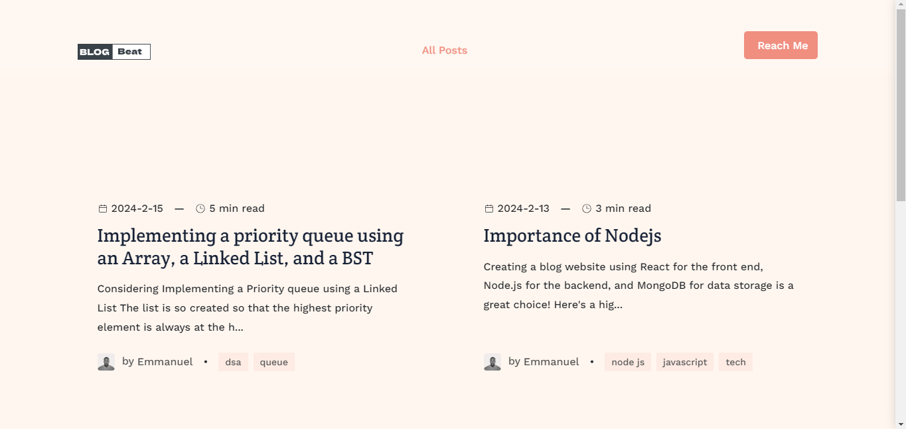
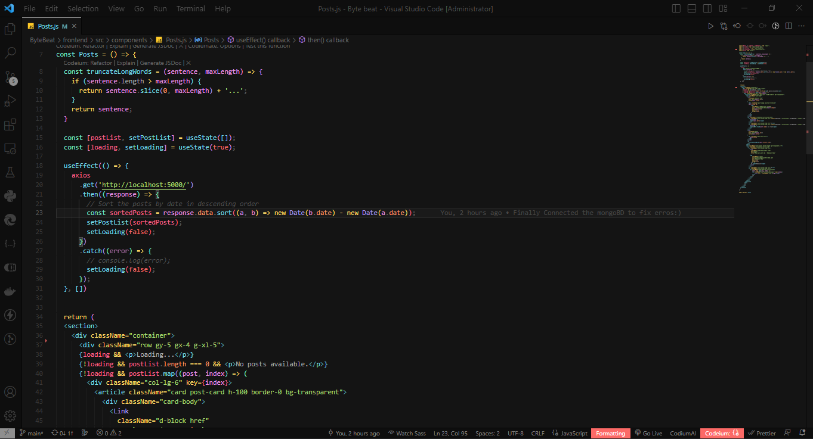
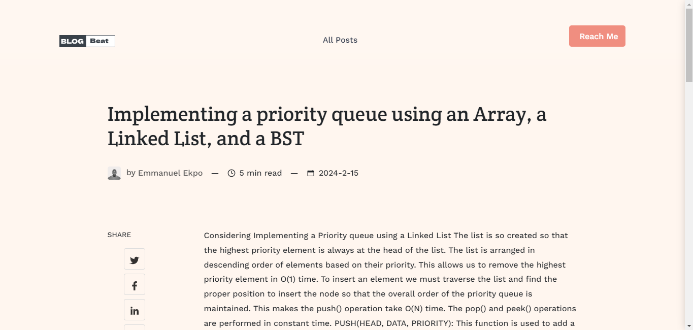
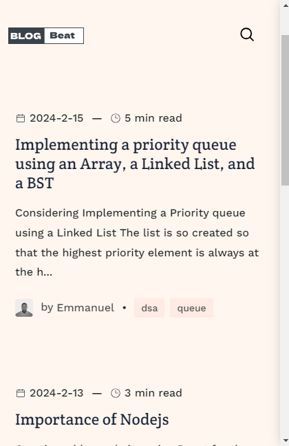
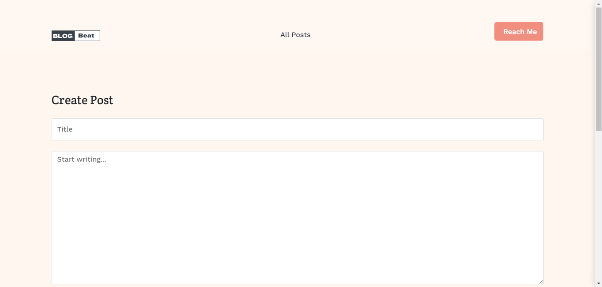
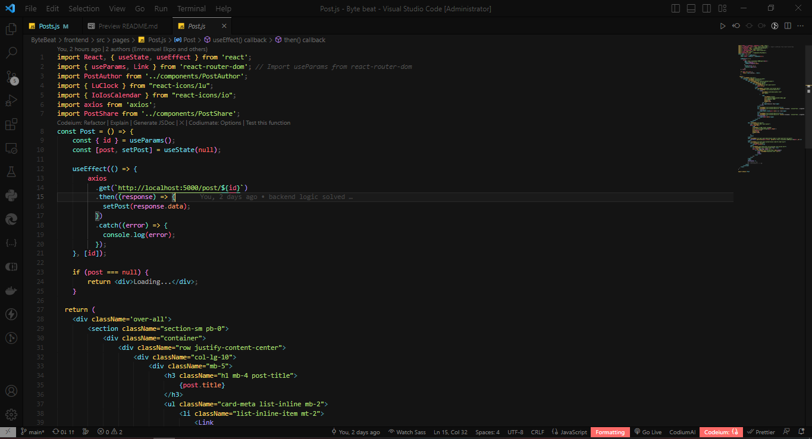
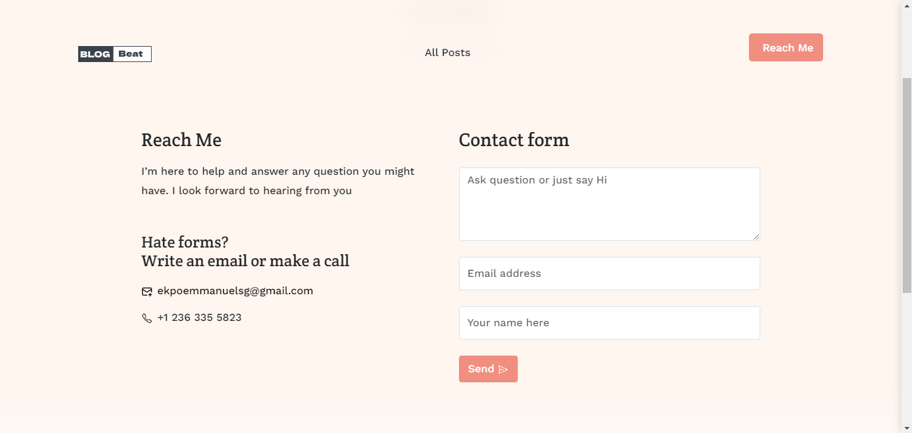
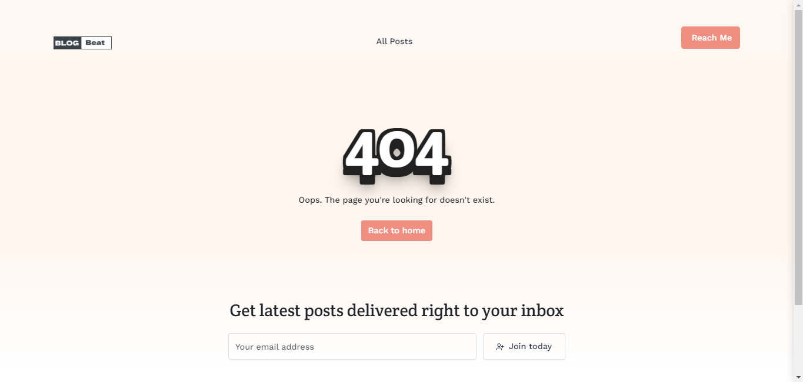

# BlogBeat

BlogBeat is a full-stack web application project aimed at providing a seamless and intuitive platform for blogging enthusiasts. Built as a task project during a hackathon organized by Bharat Intern, BlogBeat leverages modern technologies to offer a dynamic and engaging user experience.


## Features

- **User-friendly Interface**: BlogBeat offers a clean and intuitive user interface designed with React.js, ensuring a smooth and enjoyable browsing experience for users.

- **Blog Creation and Management**: Users can easily create, publish, edit, and delete blog posts using the intuitive blogging interface provided by BlogBeat.

- **Authentication and Authorization**: BlogBeat implements user authentication and authorization functionalities to ensure secure access to the blogging platform's features.

- **Responsive Design**: BlogBeat is responsive across various devices and screen sizes, allowing users to access and interact with the platform seamlessly on desktops, tablets, and mobile devices.

## Technologies Used

- **Frontend**: React.js
- **Backend**: Node.js with Express.js
- **Database**: MongoDB

## Installation

To run BlogBeat locally, follow these steps:

1. Clone the repository:
   ```
   git clone https://github.com/Ekpo-Emmanuel/ByteBeat.git
   ```

2. Navigate to the project directory:
   ```
   cd frontend
   ```

3. Install dependencies:
   ```
   npm install
   ```

4. Start the development server:
   ```
   npm start
   ```

5. Access BlogBeat in your browser at `http://localhost:3000`.


6. Navigate to the project directory:
   ```
   cd backend
   ```

7. Install dependencies:
   ```
   npm install
   ```

8. Configure Mongodb Environment Variables in the .env file:
   ```
   MONGODB_URI=YOUR_END_POINTS
   MONGODB_DB=YOUR_DB_NAME
   PORT=5000
   ```

9. Start the development server:
   ```
   npm start
   ```

10. Copy and paste in your browser at `http://localhost:5000`.

## Contributing

BlogBeat is an open-source project, and contributions are welcome! If you'd like to contribute to the development of BlogBeat, please follow these steps:

1. Fork the repository on GitHub.
2. Create a new branch from the `main` branch.
3. Make your changes and commit them to your branch.
4. Push your changes to your forked repository.
5. Submit a pull request to the `main` branch of the original repository.

## Images











